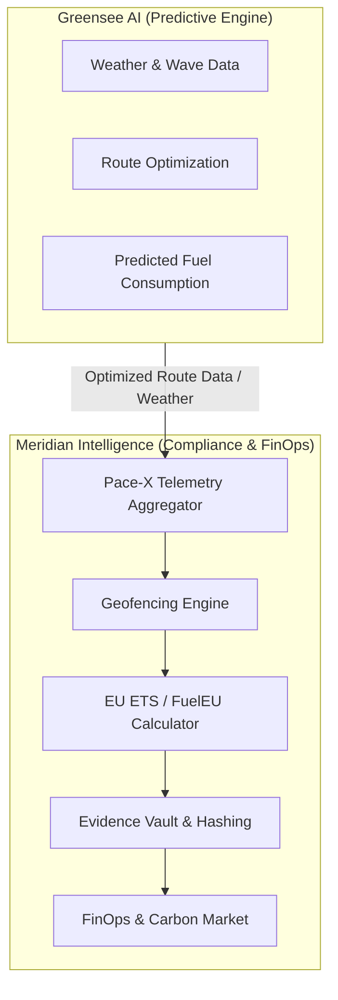

# System Map: Meridian Intelligence

This document details the system boundary and module topology, specifically highlighting the integration strategy with Greensee AI, the accessibility architecture, and legal/regulatory portals.

## 1. High-Level Integration Topology

Meridian Intelligence does not handle predictive wave, current, or weather logic. It orchestrates the compliance workflows based on data generated by third-party predictive engines (Greensee AI).

**Definition of Done (Integration):**
- Greensee AI API keys are stored securely and configured via the Admin Settings.
- Route-optimized webhooks are correctly received and mapped into the `Pace-X` telemetry system.
- Meridian focuses strictly on the regulatory mapping (e.g., matching a voyage path to European Economic Area polygons) and market impact (carbon price simulation).

## 2. A11y System (Accessibility)

The Accessibility (A11y) system operates independently of React's complex component tree by acting globally at the DOM level.

- **Component:** `AccessibilityWidget.tsx` mounted once at the root (`main.tsx`).
- **Mechanism:** Injects specific SVG filters (defined in `index.css`/`styles.css`) as CSS classes on `document.documentElement` (`<html>` tag).
- **Supported Modes:**
  - Protanopia / Deuteranopia / Tritanopia / Achromatopsia.
  - High Contrast / Invert / Dark.
  - Dyslexia-friendly typography.

## 3. Legal & API Portals

Public-facing documentation is rendered as independent, static-friendly routes:
- `/api-docs`: Swagger UI replica to document webhooks and REST endpoints.
- `/legal/:document`: Handles GDPR, Terms of Service, and Security Policies.
- `/regulatory`: Global framework viewer (EU ETS, FuelEU, IMO DCS, CBAM).

## 4. Official EU MRV Report Generator (Phase 14)

Meridian generates finalized compliance artifacts using a print-first approach.
- **Component:** `EuMrvReport.tsx`
- **Output:** Commission-styled HTML page.
- **PDF Generation:** Relies on browser-native `window.print()` triggered automatically after a short delay to simulate native PDF generation without needing heavy backend PDF libraries.
- **Linkage:** Activated via "Download Official EU MRV" triggers on verified records within the Evidence Vault workflow.

## Constraints & Current State
- **Ports DB:** Currently operating with an in-memory hardcoded DB of major global ports in `EuEtsCalculator.tsx` to simulate autocomplete without a live database.
- **Data Status:** The EU MRV Generator and Evidence Vault use **DEMO** mode placeholders to validate UI and printing mechanisms prior to live-data connection.
