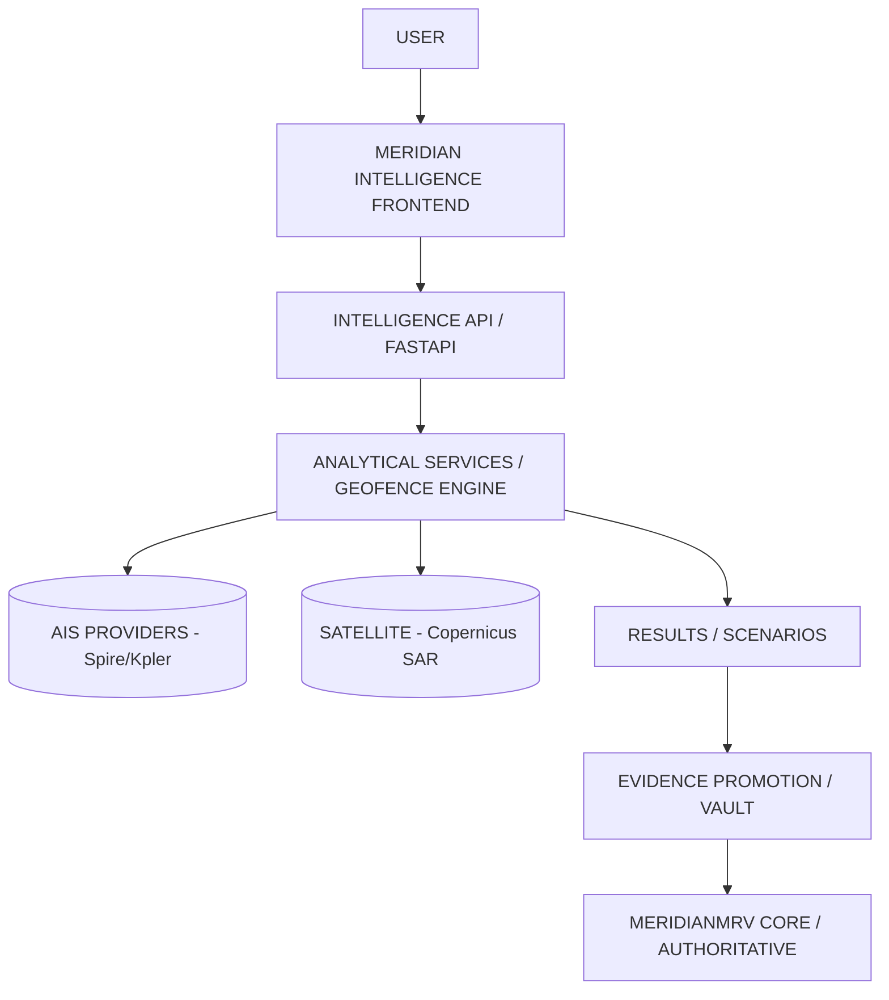

# PHASE 1 — CURRENT MERIDIAN ARCHITECTURE

## Repository Separation
The current architecture strictly segregates the **Intelligence layer** (this repository) from the **Authoritative MRV layer** (MeridianMRV Core).
- **Meridian Intelligence:** Standalone application (React/Vite Frontend + FastAPI Backend + Workers) focused on modeling, scenarios, satellite analysis, and geo-fencing.
- **MeridianMRV Core:** Assumed separate authoritative system holding actual issued credits, methodologies, and hashes.

## Integration Flow

## Exact Location of Components
- **Frontend (Maritime Intelligence):** `apps/web/src/pages/`
  - `VoyageIntelligence.tsx` (Contains MapCockpit and metrics)
  - `EvidenceVault.tsx` (Contains Sentinel-1 integration)
- **Backend (Intelligence API):** `services/api/app/`
  - Routes: `/vessels`, `/voyages`, `/evidence`
- **Geospatial Processing:** `services/api/app/core/geofence_engine.py`
- **Workers:** `services/collector/app/`
